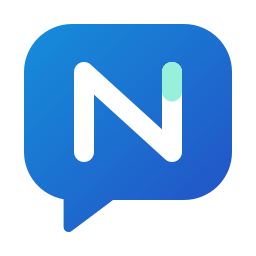

<div align="center">
  
  <h1>Nola Translator</h1>
  <p>A real-time captioning and translation app.</p>
  <p><a href="README.md">English</a> · <a href="README.zh-CN.md">简体中文</a></p>
</div>

<p align="center">
  <a href="./LICENSE"></a>
  <a href="https://github.com/CerealAxis/Nola-Translator/actions/workflows/build.yml"></a>
  <a href="https://github.com/CerealAxis/Nola-Translator/actions/workflows/build.yml"></a>
  <a href="https://github.com/CerealAxis/Nola-Translator/releases"></a>
  <a href="https://github.com/CerealAxis/Nola-Translator/releases/latest"></a>
  
  
  
  
</p>

<p align="center">
  
</p>

## Overview

Nola Translator is a real-time captioning and translation app that supports both local and cloud models. Depending on your needs, you can use local computing resources for speech recognition and translation, or connect to cloud models for recognition and translation.

## Features

- **Local models:** Run recognition models such as Qwen3-ASR and SenseVoiceSmall, and translation models such as HY-MT2 locally. The app can also search for and install other models from Hugging Face.
- **Cloud models:** Use LLM providers that support protocols such as OpenAI-compatible APIs, Anthropic, and Ollama for caption translation. Cloud ASR support is planned for a future release.
- **GPU acceleration:** Detects available compute devices and lets you configure separate devices for recognition and translation.
- **Browser extension:** Includes a browser extension for Chrome and Edge that displays bilingual captions on video pages. You can also configure desktop system audio as an input source.
- **Real-time caption overlay:** Supports system output, a selected audio device, or a microphone. Captions appear in a separate overlay, where you can adjust its position, font size, colors, opacity, and original/translated text layout.
- **Flexible configuration:** Install models as needed and choose recognition and translation methods, language directions, compute devices, and caption styles. API credentials are securely stored by the app.
- **History and export:** Save caption history and export it as TXT, SRT, or WebVTT. Audio recording can be enabled optionally.

## Interface Preview

| Home | Floating Captions | Video Captions |
|---|---|---|
|  |  |  |

| Local Model Installation | Inference Environment Settings | Dark Mode Support |
|---|---|---|
|  |  |  |

## Installation

- [Download the latest release](https://github.com/CerealAxis/Nola-Translator/releases/latest)

Windows x64 is supported. You can choose the EXE or MSI installer. Support for other platforms is planned once development has stabilized.

## Supported Recognition Languages

> [!TIP]
> The languages available for recognition and translation depend on the selected model's capabilities. The tables below show the capabilities of the recommended models included in the app. If you have a model to recommend, submit it as an issue; we will evaluate it for possible inclusion. For first-time users, we recommend **SenseVoiceSmall** for recognition and **HY-MT2 1.8B** for translation.

### Recognition Models

| Model | Number of Languages | Details |
|---|---:|---|
| Qwen3-ASR 1.7B | 30 | Supports automatic detection; Chinese, English, Cantonese, Arabic, German, French, Spanish, Portuguese, Indonesian, Italian, Korean, Russian, Thai, Vietnamese, Japanese, Turkish, Hindi, Malay, Dutch, Swedish, Danish, Finnish, Polish, Czech, Filipino, Persian, Greek, Hungarian, Macedonian, and Romanian |
| Qwen3-ASR 0.6B | 30 | Supports automatic detection; Chinese, English, Cantonese, Arabic, German, French, Spanish, Portuguese, Indonesian, Italian, Korean, Russian, Thai, Vietnamese, Japanese, Turkish, Hindi, Malay, Dutch, Swedish, Danish, Finnish, Polish, Czech, Filipino, Persian, Greek, Hungarian, Macedonian, and Romanian |
| SenseVoiceSmall | 5 | Chinese, English, Cantonese, Japanese, and Korean |

### Translation Models

| Model | Number of Languages | Details |
|---|---:|---|
| HY-MT2 1.8B | 37 | Simplified Chinese, Traditional Chinese, English, French, Portuguese, Spanish, Japanese, Turkish, Russian, Arabic, Korean, Thai, Italian, German, Vietnamese, Malay, Indonesian, Filipino, Hindi, Polish, Czech, Dutch, Khmer, Burmese, Persian, Gujarati, Urdu, Telugu, Marathi, Hebrew, Bengali, Tamil, Ukrainian, Tibetan, Kazakh, Mongolian, and Uyghur |
| M2M100 418M | 100 | Afrikaans, Amharic, Arabic, Asturian, Azerbaijani, Bashkir, Belarusian, Bulgarian, Bengali, Breton, Bosnian, Catalan, Cebuano, Czech, Welsh, Danish, German, Greek, English, Spanish, Estonian, Persian, Fula, Finnish, French, Western Frisian, Irish, Scottish Gaelic, Galician, Gujarati, Hausa, Hebrew, Hindi, Croatian, Haitian Creole, Hungarian, Armenian, Indonesian, Igbo, Ilocano, Icelandic, Italian, Japanese, Javanese, Georgian, Kazakh, Khmer, Kannada, Korean, Luxembourgish, Ganda (Luganda), Lingala, Lao, Lithuanian, Latvian, Malagasy, Macedonian, Malayalam, Mongolian, Marathi, Malay, Burmese, Nepali, Dutch, Norwegian, Northern Sotho, Occitan, Odia, Punjabi, Polish, Pashto, Portuguese, Romanian, Russian, Sindhi, Sinhala, Slovak, Slovenian, Somali, Albanian, Serbian, Swati, Sundanese, Swedish, Swahili, Tamil, Thai, Filipino, Tswana, Turkish, Ukrainian, Urdu, Uzbek, Vietnamese, Wolof, Xhosa, Yiddish, Yoruba, Chinese, and Zulu |

## LLM API Configuration

> [!TIP]
> LLMs are used only for translation. No API configuration is needed when using local models or other local translation options. Cloud ASR support is planned for a future release.

### Supported Protocols

The app supports the following API protocols:

| Protocol |
|---|
| OpenAI Chat Completions |
| OpenAI Responses |
| Anthropic Messages |
| Ollama Chat |

### Configuration Examples

| Provider | API Format | Example API URL | Example Model ID |
|---|---|---|---|
| DeepSeek | OpenAI Chat Completions | `https://api.deepseek.com` | `deepseek-flash` |
| MiniMax | OpenAI Chat Completions | `https://api.minimax.io/v1` | `MiniMax-M3` |
| MiMo | OpenAI Chat Completions | `https://api.xiaomimimo.com/v1` | `mimo-v2.6-pro` |

### Configuration Steps


1. Select **Cloud Translation** in the translation settings.
2. Choose the **API format** supported by your provider.
3. Enter the **API URL**, **API key**, and **model ID**.
4. Adjust the context window and maximum output tokens as needed.

## Project Structure

```text
assets/brand/                  Logo and brand assets
docs/                          Design and implementation documents
engine/nola_translator_engine/  Python audio, recognition, and translation engine
engine/tests/                   Python tests
scripts/                        Setup and build scripts
src/main/                       Electron main process
src/preload/                    IPC bridge
src/renderer/                   React interface
src/shared/                     Shared contracts and settings
tests/                          Application tests
```

## Development and Build

```powershell
npm run typecheck
npm test
.\.venv\Scripts\python.exe -m pytest engine\tests
npm run build
```

Build the Windows x64 installer:

```powershell
npm run dist:win
```

## Contributing

Fork the repository, create a branch, make your changes, and open a pull request. Briefly describe your changes and the checks you ran. For design and code conventions, see the [interface guidelines](docs/design-system.md) and [implementation notes](docs/implementation.md).

## License

Nola Translator's original code is licensed under [GNU GPL v3.0 only](LICENSE). Third-party components and models are subject to their respective licenses; see [Third-Party Notices](THIRD_PARTY_NOTICES.md).

[](https://star-history.com/#CerealAxis/Nola-Translator)
