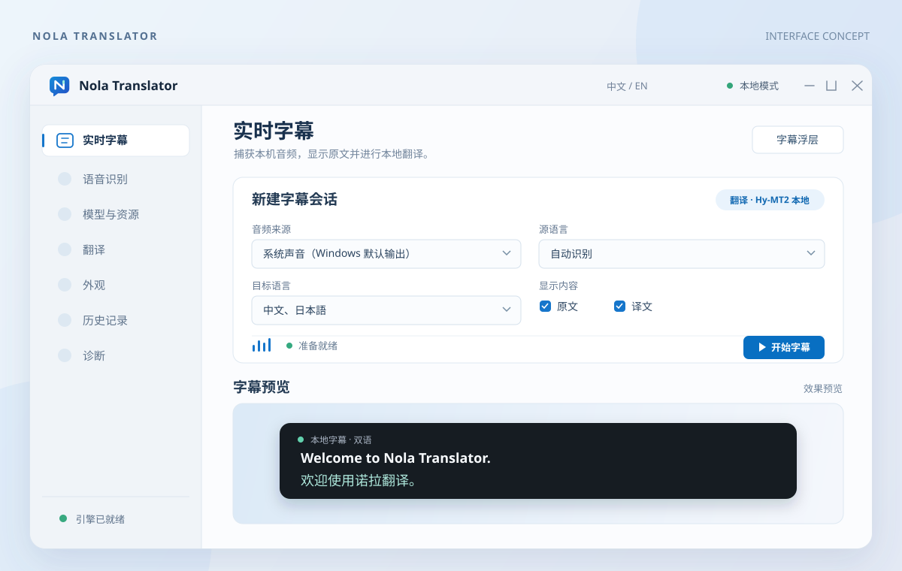

# Nola Translator

**Real-time captions and translation for Windows 11.**

English | [简体中文](README.zh-CN.md)



## Contents

- [Overview](#overview)
- [Features](#features)
- [Getting started](#getting-started)
- [Usage](#usage)
- [Project structure](#project-structure)
- [Architecture](#architecture)
- [Development](#development)
- [Contributing](#contributing)
- [License](#license)

## Overview

Nola Translator captures system audio or microphone input, transcribes speech, and displays original and translated captions in a separate overlay. The desktop app is built with Electron, React, and TypeScript; a Python engine handles audio capture, speech recognition, and translation.

## Features

- Capture the default Windows output device, a selected output device, or a microphone.
- Run Qwen3-ASR locally for speech recognition and Hy-MT2 or M2M100 locally for translation.
- Translate into multiple target languages, with optional translation of interim captions.
- Use Microsoft Translator, an OpenAI-compatible API, or local Ollama when configured.
- Position, resize, lock, and make the independent caption overlay click-through.
- Adjust caption typography, colors, opacity, and original/translation display.
- Export saved captions as TXT, SRT, or WebVTT.
- Switch the app between Chinese and English; use light, dark, or high-contrast themes.
- Keep caption history in memory by default. Disk storage is opt-in.

## Getting started

### Requirements

- Windows 11 x64
- Node.js 24 and npm 11
- Python 3.13

### Install and run

From the project root, run:

```powershell
Set-ExecutionPolicy -Scope Process Bypass
.\scripts\install.ps1
.\scripts\install-engine.ps1
.\scripts\fetch-llama.ps1
npm run dev
```

The install scripts set up the JavaScript and Python dependencies. `fetch-llama.ps1` installs the pinned local llama.cpp runtime used by Hy-MT2.

Open **Models & Resources** in the app to install the recognition and translation models you want to use. Model downloads start only when you select them there. The model and download-cache locations can be changed on that page.

## Usage

1. Select an audio source, source language, and target languages on **Live Captions**.
2. Choose the original and translated text to display, then start the session.
3. Adjust the separate subtitle overlay on **Appearance**.
4. Enable history saving on **History** if you want captions retained after closing the app.

Local recognition and translation can run offline after their resources are installed. Microsoft Translator and OpenAI-compatible translation require their respective services. API keys are stored through Electron `safeStorage`.

## Project structure

```text
assets/brand/                  Logo and brand assets
docs/                          Design and implementation notes
engine/nola_translator_engine/  Python audio, recognition, and translation engine
engine/tests/                   Python tests
scripts/                        Setup and build scripts
src/main/                       Electron main process
src/preload/                    IPC bridge
src/renderer/                   React interface
src/shared/                     Shared contracts and settings
tests/                          Application tests
```

## Architecture

```text
React UI ── preload IPC ── Electron main ── JSONL protocol ── Python engine
                                                       ├─ audio capture
                                                       ├─ Qwen3-ASR
                                                       └─ translation
```

See [implementation notes](docs/implementation.md), the [audio pipeline](docs/audio.md), and the [Electron–Python protocol](docs/protocol.md).

## Development

```powershell
npm run typecheck
npm test
.\.venv\Scripts\python.exe -m pytest engine\tests
npm run build
```

To build the Windows x64 installer:

```powershell
npm run dist:win
```

The installer is written to `release\`. It bundles the Python sidecar and llama.cpp runtime; recognition and translation models are downloaded separately in the app.

## Contributing

Fork the repository, create a branch, make your changes, and open a pull request. Include a concise description of the change and the relevant checks you ran. For design and code conventions, see the [interface guidelines](docs/design-system.md) and [implementation notes](docs/implementation.md).

## License

Nola Translator's original code is licensed under [GNU GPL v3.0 only](LICENSE). Third-party components and models retain their respective licenses; see [Third-Party Notices](THIRD_PARTY_NOTICES.md).
