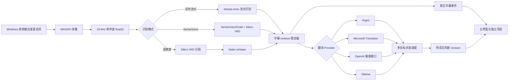

# 识别、翻译与数据流实现

## 完整数据流

## 实时识别

实时流式模式使用 sherpa-onnx OnlineRecognizer。音频以 20 ms 帧连续送入解码器；文本变化时最多每 100 ms 发送一次中间结果，检测到端点后发送最终结果并重置流。内置模型目录指向官方中英双语 Zipformer Small INT8 模型。只有用户在“模型与语言包”页面点击安装后才下载，压缩包同时校验字节数和 MD5，再原子安装。

## SenseVoice 识别

SenseVoiceSmall 使用 sherpa-onnx 的 `OfflineRecognizer.from_sense_voice`，配合同一套 Silero VAD。在语音片段尚未结束时，按约 280 ms 对当前音频快照重新解码并发送中间 revision；片段结束后再发送带标点的最终 revision。为避免长时间说话导致重复推理越来越慢，中间结果最多回看 12 秒；模型资源页提供中、粤、英、日、韩五种语言的选择提示，识别页会根据模型能力收窄源语言选项。模型文件只在用户点击“安装”后下载，安装完成后可离线使用。

## 高精度识别

高精度模式先用 faster-whisper 自带的 Silero VAD ONNX 模型做流式语音分段，再把完整片段送给 faster-whisper `small`。初始化时先尝试 CUDA + FP16；不可用或初始化失败时自动回退 CPU + INT8。自动语言识别结果会随最终字幕传给翻译调度器。

## 翻译

- Argos：默认 Provider。优先安装并使用直译包；只有用户勾选“允许中转”时，才会尝试 `源语言 → English → 目标语言`。
- Microsoft：调用 Translator v3 `translate` 接口，密钥由 Windows 加密存储提供。
- OpenAI 兼容：调用用户配置根地址下的 `/chat/completions`，适用于 OpenAI 和兼容实现。
- Ollama：调用本机或用户配置地址下的 `/api/chat`，关闭响应流并要求模型只返回译文。

一个最终原文可同时翻译到最多八个目标语言。调度器对各目标并发执行，设置单目标超时，并使用 512 项进程内 LRU 缓存。相同字幕段的新 revision 会使旧翻译结果失效，避免迟到结果覆盖新文本。

## 字幕、历史与导出

每个字幕段拥有稳定 `segmentId` 和单调递增 `revision`。中间结果可被主进程合并，最终结果不会丢弃。历史模块只接受最终字幕：默认只存内存；开启持久化时，把现有内存字幕和后续字幕写入 JSONL。导出时从同一内存视图生成 TXT、SRT 或 WebVTT。

## 进程与安全边界

Electron 主进程管理 Python sidecar，通过 UTF-8 JSONL 通信。渲染进程启用沙箱、上下文隔离并禁用 Node.js；preload 只暴露白名单 API。普通设置使用原子 JSON 写入，API 密钥使用 Windows 加密能力保存。打包版使用 `resources\engine\FluentCaptionsEngine.exe`，模型位于用户数据目录。资源查询和字幕启动均不联网，只有显式资源安装命令允许下载。
