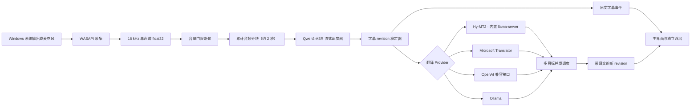

# 识别、翻译与数据流实现

## 完整数据流

## Qwen3-ASR 识别运行时

识别使用单一模型 `Qwen/Qwen3-ASR-1.7B-hf`（`recognitionModelId` 固定为 `qwen3-asr-1.7b-hf`）。运行时以 `AutoProcessor` + `Qwen3ASRForConditionalGeneration` 从本地安装目录 `from_pretrained(..., local_files_only=True)` 加载，进程内缓存：首次“开始字幕”加载一次，引擎退出时释放，会话期间不重复加载；同一时刻只运行一个 ASR 请求（单飞锁，排队请求由调度器合并）。加载默认使用 bitsandbytes NF4（`load_in_4bit`），NF4 失败时回退 8bit，两者都失败则后续启动返回 `modelUnavailable`，不会暗中换用其他模型；可用 `NOLA_TRANSLATOR_QWEN_QUANT=nf4|8bit` 强制档位。推理在 `torch.inference_mode()` 内执行，输入固定为 16 kHz 单声道 float32 数组、dtype 固定 bf16。会话启动前只检查本地资源存在性，缺失时引导到“模型与资源”页面，不联网下载。

## 流式调度与断句

- **断句**：不依赖第三方 VAD 模型，改为音量门限 + 自适应噪声基线 + 静音迟滞：保留约 200 ms 前置音频；约 600 ms 静音结束一段；连续语音达到 30 秒强制切段；门控语音短于约 250 ms 的片段丢弃；停止会话或音频设备断开时处理已采集的尾音。
- **分块**：每积累约 2 秒音频执行一次识别，识别对象是累计全量音频。前两块不固定已有文本；之后将上一结果末尾 5 个 token 回退，其余文本作为前缀（经 chat template 构造），避免截断多字节字符造成的重复或漏字。
- **中间与最终结果**：中间结果更新同一 `segmentId` 并递增 `revision`；语音结束时即使尾部不足 2 秒也再识别一次并提交 `isFinal=true`，空转写不产生字幕事件。
- **解耦与过期**：采集线程持续写入有界缓冲；推理繁忙时合并尚未开始的中间识别请求（保留最新累计音频快照与最终请求）；执行中无法取消的结果按 `sessionId + segmentId + revision` 判定过期，过期结果不进入字幕、不进入翻译。
- **性能边界（界面文案）**：首条中间字幕约需 2 秒语音加推理时间。

## 资源安装

`RESOURCE_DEFINITIONS` 恰好两条，revision 与逐文件 sha256 在引擎内钉死（禁用浮动 `main`）：

- `qwen3-asr-1.7b-hf`：HuggingFace `Qwen/Qwen3-ASR-1.7B-hf` 快照（9 个文件，合计约 4.09 GB BF16 权重）；
- `hy-mt2-1.8b-q4-k-m`：HuggingFace `tencent/Hy-MT2-1.8B-GGUF` 的单文件 `Hy-MT2-1.8B-Q4_K_M.gguf`（约 1.13 GB，预量化 Q4_K_M）。

安装流程为 `download → verify → install`：直连 `resolve/<revision>/<path>` 下载到 `.part`，逐文件校验大小与 sha256，再整体原子切换到目标目录（沿用 `.part` / `os.replace` / `.corrupt` 隔离模式）；进度只在已知 `Content-Length` 时上报 0..1，取消后清理临时目录回到 `idle`，失败置 `failed` + 错误码可重试。`listResources` 只扫描本地文件，`startSession` 永不下载。资源安装成功后按精确已知名称清理旧模型残留（三个旧识别模型目录与 `.part`/`.corrupt`，以及应用管理的 Argos 数据/配置/缓存目录），不触碰 Ollama 模型与用户自有目录。

## 翻译

- Hy-MT2（默认 Provider）：应用打包的 Windows CUDA 版 `llama-server` 以 `127.0.0.1` 临时端口启动，`startSession(provider=hymt2)` 时拉起并轮询 `/health` 就绪，`stopSession`/`shutdown` 时退出释放显存；启动失败或 OOM 时固定降级为 CPU（`-ngl 0`）重启，同一会话内不来回切换。提示词采用官方模板（完整目标语言名 + “只输出译文”约束）。默认只翻译最终字幕，开启“翻译中间结果”后对变化原文按 0.3 s 限频提交，最终字幕立即优先提交。
- Microsoft：调用 Translator v3 `translate` 接口，密钥由 Windows 加密存储提供。
- OpenAI 兼容：调用用户配置根地址下的 `/chat/completions`，适用于 OpenAI 和兼容实现。
- Ollama：调用本机或用户配置地址下的 `/api/chat`，关闭响应流并要求模型只返回译文。

一个最终原文可同时翻译到最多八个目标语言。调度器对各目标并发执行，设置单目标超时，并使用 512 项进程内 LRU 缓存。相同字幕段的新 revision 会使旧翻译结果失效，避免迟到结果覆盖新文本。翻译失败时保留原文并显示具体失败状态（`llamaServerUnavailable`、`resourceUnavailable`、`translationTimeout` 等）。

## 字幕、历史与导出

每个字幕段拥有稳定 `segmentId` 和单调递增 `revision`。中间结果可被主进程合并，最终结果不会丢弃。历史模块只接受最终字幕：默认只存内存；开启持久化时，把现有内存字幕和后续字幕写入 JSONL。导出时从同一内存视图生成 TXT、SRT 或 WebVTT。

## 进程与安全边界

Electron 主进程管理 Python sidecar，通过 UTF-8 JSONL 通信。渲染进程启用沙箱、上下文隔离并禁用 Node.js；preload 只暴露白名单 API。普通设置使用原子 JSON 写入，API 密钥使用 Windows 加密能力保存。

引擎在 `<modelRoot>/.runtime/engine-status.json` 维护运行状态（`qwen` 的量化档位与加载状态、`hymt2` 的 `cuda|cpu` 设备与就绪状态），加载/卸载与 llama-server 启停时原子写入、退出时清理；诊断页读取该文件，缺失或损坏时显示“未运行”。

打包布局：PyInstaller onedir sidecar 位于 `resources\engine\`（包含 torch、transformers、bitsandbytes、accelerate 等识别运行时，不含旧 sherpa/Whisper/Argos 栈）；llama.cpp 运行时经 electron-builder `extraResources` 从 `vendor/llama` 打入 `resources\llama\`，由 `scripts\fetch-llama.ps1` 按钉死版本拉取，不进入 PyInstaller。模型位于用户数据目录，不随安装包分发。资源查询和字幕启动均不联网，只有显式资源安装命令允许下载。
