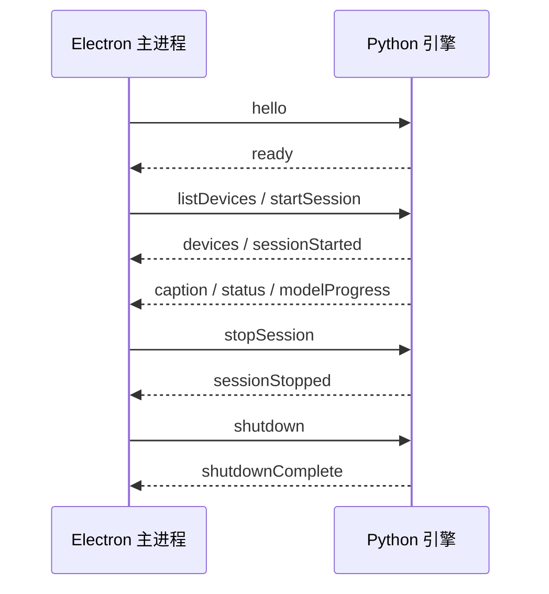

# Electron 与 Python 通信协议

FluentCaptions 的 Electron 主进程通过标准输入和标准输出管理独立 Python 引擎。协议采用 UTF-8 JSON Lines：每条消息占一行，当前 `protocolVersion` 固定为 `1`。

## 边界与安全约束

- Python 的 stdout 只允许输出协议 JSON；诊断日志只写 stderr。
- 单行序列化后不得超过 32 KiB，超过时返回 `lineTooLarge`。
- 所有命令和事件必须包含非空 `requestId`，请求响应沿用同一个 ID。
- 未知消息类型、缺少必填字段或非法数值会被拒绝；未知的非关键字段会被忽略，以便旧版本读取新版本消息。
- `error.code` 必须使用协议中的枚举代码，`details` 只能包含不敏感的结构化上下文，不依赖自然语言错误文本进行程序判断。
- 字幕正文、密钥和完整音频设备 ID 不写入主进程日志。

## 启动与退出



启动后 10 秒内没有收到 `ready` 即视为失败。异常退出最多自动重启三次，默认退避为 250 ms、1 秒和 4 秒；用户主动退出不会触发重启。

开发态使用项目已有的 `.venv\\Scripts\\python.exe -m fluentcaptions_engine`；打包后使用 `resources\\engine\\FluentCaptionsEngine.exe`，最终用户无需安装 Python。

## 字幕事件

`caption` 携带以下稳定结构：

```json
{
  "protocolVersion": 1,
  "type": "caption",
  "requestId": "event-caption-1",
  "sessionId": "session-1",
  "segment": {
    "segmentId": "segment-1",
    "revision": 2,
    "startedAtMs": 120,
    "endedAtMs": 940,
    "sourceLanguage": "en",
    "sourceText": "Hello world",
    "isFinal": true,
    "translations": [
      {
        "targetLanguage": "zh-CN",
        "text": "你好，世界",
        "state": "complete",
        "provider": "argos"
      }
    ]
  }
}
```

`revision` 从 0 开始并且只能递增。主进程允许合并同一 `segmentId` 的中间版本，只向界面投递当前最新版本；最终字幕、错误和模型进度不会被合并或丢弃。最终字幕到达后，该字幕段的迟到中间结果将被忽略。

共享协议样例位于 `tests/fixtures/protocol/messages.json`，TypeScript/Zod 与 Python/Pydantic 测试共同读取该文件，防止两端字段定义漂移。
