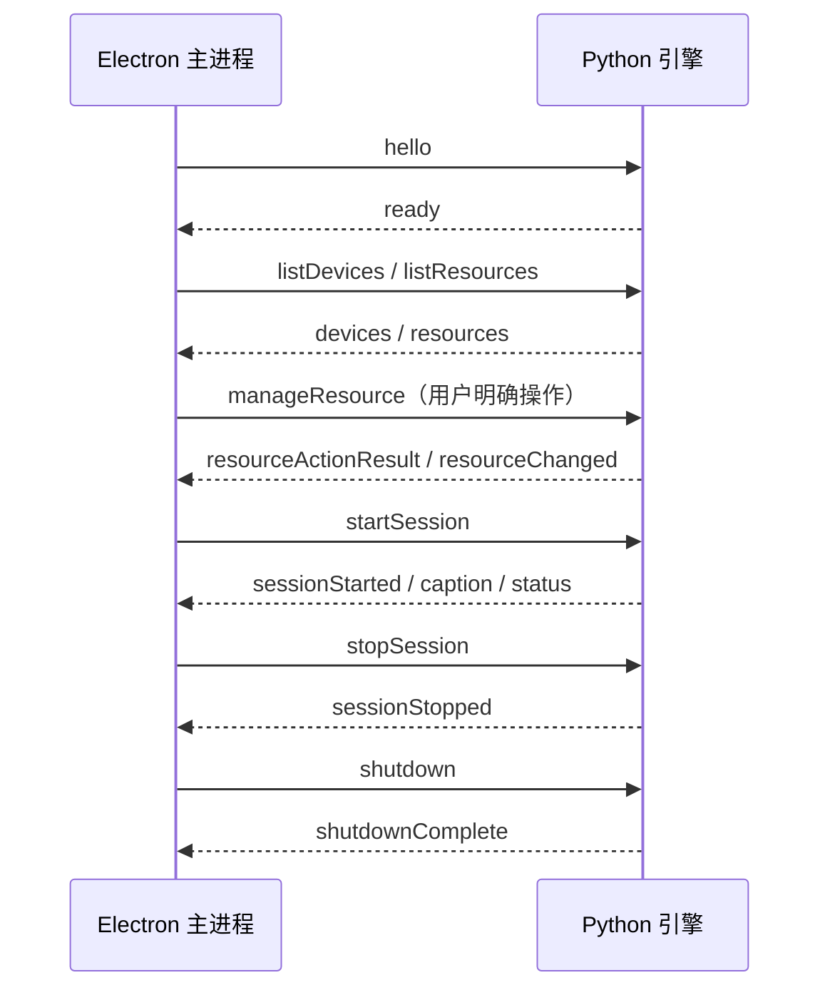

# Electron 与 Python 通信协议

Nola Translator 的 Electron 主进程通过标准输入和标准输出管理独立 Python 引擎。协议采用 UTF-8 JSON Lines：每条消息占一行，当前 `protocolVersion` 固定为 `1`。

## 边界与安全约束

- Python 的 stdout 只允许输出协议 JSON；诊断日志只写 stderr。
- 单行序列化后不得超过 32 KiB，超过时返回 `lineTooLarge`。
- 所有命令和事件必须包含非空 `requestId`，请求响应沿用同一个 ID。
- 未知消息类型、缺少必填字段或非法数值会被拒绝；未知的非关键字段会被忽略，以便旧版本读取新版本消息。
- `error.code` 必须使用协议中的枚举代码，`details` 只能包含不敏感的结构化上下文，不依赖自然语言错误文本进行程序判断。
- 字幕正文、密钥和完整音频设备 ID 不写入主进程日志。

## 启动与退出



启动后 10 秒内没有收到 `ready` 即视为失败。异常退出最多自动重启三次，默认退避为 250 ms、1 秒和 4 秒；用户主动退出不会触发重启。

开发态使用项目已有的 `.venv\\Scripts\\python.exe -m nola_translator_engine`；打包后使用 `resources\\engine\\NolaTranslatorEngine.exe`，最终用户无需安装 Python。

## 会话配置

`startSession.config` 包含音频来源、识别模式、具体识别模型、源语言、最多八个目标语言和翻译 Provider。例如：

```json
{
  "audioSource": { "kind": "defaultOutput" },
  "recognitionMode": "realtime",
  "recognitionModelId": "qwen3-asr-1.7b-hf",
  "sourceLanguage": "auto",
  "targetLanguages": ["zh", "ja"],
  "translationProvider": "hymt2",
  "allowIntermediateTranslation": false,
  "recordingPath": "C:/Users/me/AppData/Roaming/NolaTranslator/meetings/20260929-225000-a1b2c3d4/audio.wav"
}
```

`recognitionModelId` 可选值为 `qwen3-asr-1.7b-hf`、`qwen3-asr-0.6b-hf` 或 `sensevoice-small`；旧客户端省略该字段时，Python 引擎按 `qwen3-asr-1.7b-hf` 处理。SenseVoiceSmall 只覆盖中英日韩粤五种语言，传入其余源语言时引擎回落到模型自判。`recognitionMode` 为消息结构兼容字段，不再决定识别模型。

`translationProvider` 可为 `hymt2`（本地 llama.cpp + Hy-MT2）、`microsoft`、`openai` 或 `ollama`。联网 Provider 的地址、区域和模型放在 `translationOptions`；API 密钥由 Electron 主进程从 Windows 加密存储读取，只在发送 `startSession` 时注入，不暴露给渲染进程。`allowIntermediateTranslation` 默认 `false`——只翻译最终字幕；为 `true` 时对变化中的中间字幕限频提交翻译，最终字幕始终优先。`hymt2` 在 `startSession` 前校验目标语言，不支持的组合返回 `invalidConfiguration`。

`recordingPath` 是可选字段，且只由 Electron 主进程下发。开启一次字幕会话就是开启一次会议记录，所以主进程会在发出请求之前就建好会议目录，并把该路径交给引擎。引擎在重采样之后、识别之前把每一帧 16 kHz 单声道音频追加写入该文件（16 bit PCM，约 32 KB/s，一小时约 115 MB）；字幕与录音共用同一个帧源，被背压丢弃的 chunk 两边都不出现，因此录音与字幕天然对齐。该路径打不开时（磁盘满、目录被锁、权限不足）引擎继续识别并照常发字幕，只是本次会议没有音频——`startSession` 不会因此失败。会话结束时引擎回写 WAV 头部的真实长度，因此即使进程被强杀，留下的文件仍是可播放的合法 RIFF，只是数据长度为 0。

## 资源管理

`listResources` 只扫描本地文件，返回识别模型（`kind: "recognitionModel"`，`provider: "qwen3-asr"`）与本地翻译模型（`kind: "translationModel"`，`provider: "hy-mt2"`）的安装状态、占用空间与当前操作。`manageResource` 只接受内置 `resourceId`（`qwen3-asr-1.7b-hf`、`hy-mt2-1.8b-q4-k-m`），动作可为 `install`、`remove` 或 `cancel`；渲染进程不能传入下载 URL 或任意文件路径。两类资源的安装均支持取消与逐文件校验，`phase` 依次经过 `download`、`verify`、`install`。

资源操作先返回 `resourceActionResult`，后台状态变化通过 `resourceChanged` 推送。已知总大小时 `progress` 为 0 到 1；下载源不提供总大小时省略进度，界面显示不定进度条，不伪造百分比。

`startSession` 不会隐式下载、更新或安装资源。缺少识别模型时立即返回 `resourceUnavailable`，并在 `details.missingResourceIds` 中给出缺失项。缺少本地翻译模型时不阻断识别；对应译文标记为失败（`resourceUnavailable`），不影响原文识别，也不会联网补包。

## 字幕事件

`caption` 携带以下稳定结构：

```json
{
  "protocolVersion": 1,
  "type": "caption",
  "requestId": "event-caption-1",
  "sessionId": "session-1",
  "segment": {
    "segmentId": "segment-1",
    "revision": 2,
    "startedAtMs": 120,
    "endedAtMs": 940,
    "sourceLanguage": "en",
    "sourceText": "Hello world",
    "isFinal": true,
    "translations": [
      {
        "targetLanguage": "zh-CN",
        "text": "你好，世界",
        "state": "complete",
        "provider": "hymt2"
      }
    ]
  }
}
```

`revision` 从 0 开始并且只能递增。主进程允许合并同一 `segmentId` 的中间版本，只向界面投递当前最新版本；最终字幕、错误和模型进度不会被合并或丢弃。最终字幕到达后，该字幕段的迟到中间结果将被忽略。

共享协议样例位于 `tests/fixtures/protocol/messages.json`，TypeScript/Zod 与 Python/Pydantic 测试共同读取该文件，防止两端字段定义漂移。
